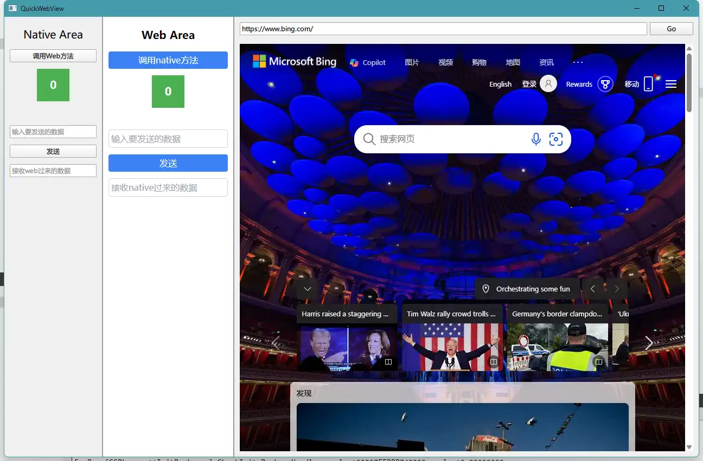

# QuickWebView

一个用于 QML 的小型跨平台 webview 库，用于构建现代跨平台 GUI。

它支持双向 JavaScript 绑定（从 C/C++ 调用 JavaScript，以及从 JavaScript 调用 C/C++）。

> [!NOTE]
> 需要Qt6.7.0+

## 支持平台

| Platform | Technologies                                      |
| -------- | ------------------------------------------------- |
| Linux    | [GTK][gtk], [WebKitGTK][webkitgtk]（待开发）      |
| macOS    | Cocoa, [WebKit][webkit]                           |
| Windows  | [Windows API][win32-api], [WebView2][ms-webview2] |

## 程序截图

